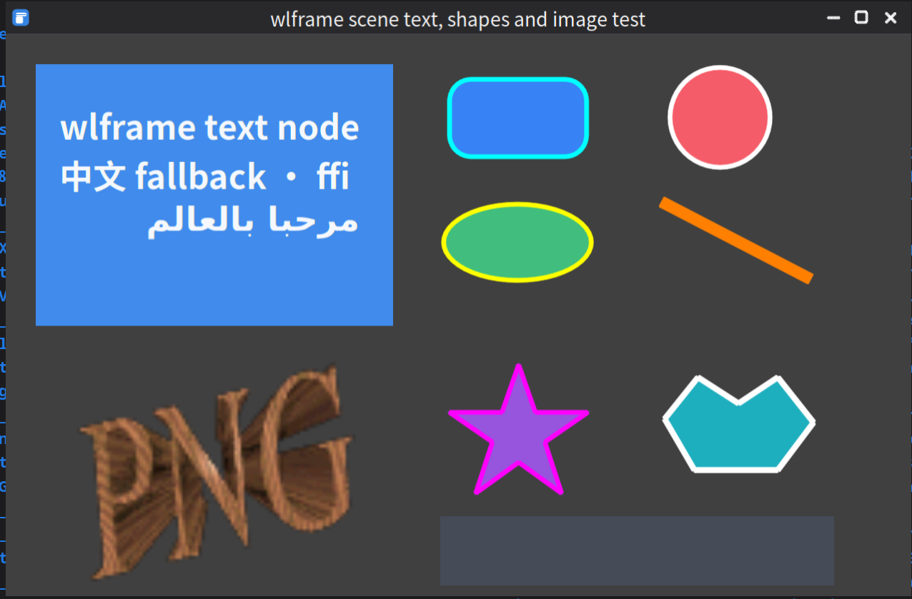
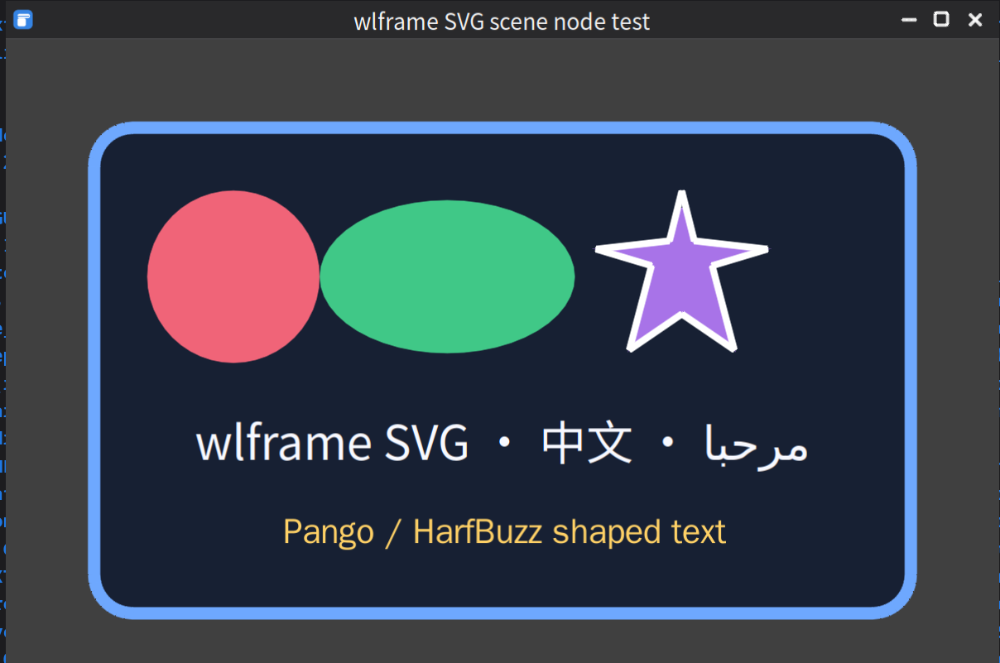
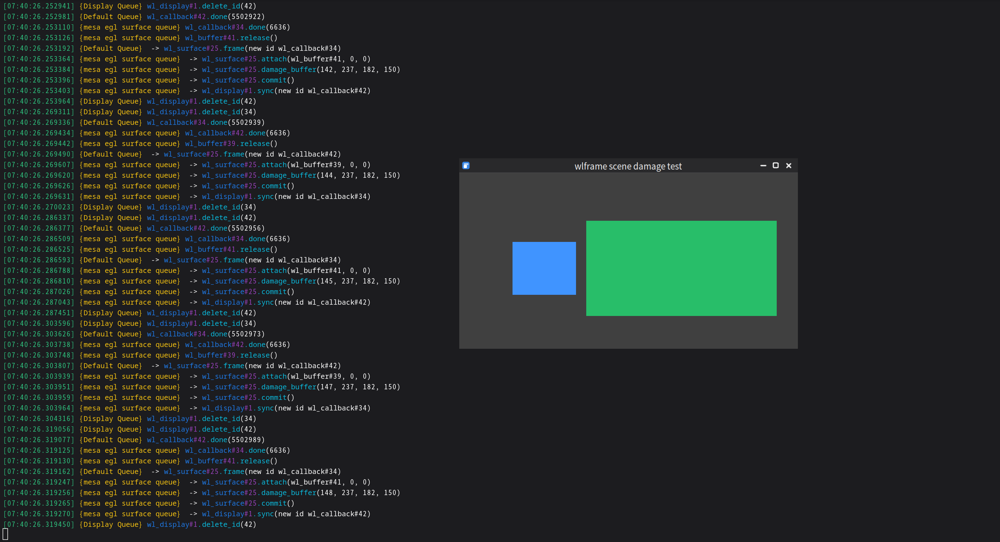

# wlframe

[](https://github.com/zzxyb/wlframe/actions/workflows/archlinux-build.yaml)
[](https://github.com/zzxyb/wlframe/actions/workflows/macos-build.yaml)
[](https://github.com/zzxyb/wlframe/actions/workflows/windows-build.yaml)

**wlframe** is an experimental, cross-platform UI and rendering framework
written in C. It provides the building blocks for native graphical
applications without imposing a widget toolkit or application architecture.

The project combines platform backends, GPU and software renderers, swapchains,
window management, a retained scene graph, vector graphics, text shaping,
images, input events, effects, and animations behind a small C API. Its design
is: objects are explicit, ownership is predictable, and applications can use
the low-level pieces independently.

> [!IMPORTANT]
> wlframe is under active development. The API is not stable yet and production
> use is not recommended without pinning a known-good revision.

## Screenshots

### Scene graph, text, shapes, and images

The scene graph can combine multilingual text, raster images, and vector
primitives in the same window.

<p align="center">
  
</p>

| SVG scene node | Damage-tracked rendering |
| --- | --- |
|  |  |
| SVG shapes and multilingual Pango/HarfBuzz text | Only changed regions are submitted to the compositor |

## What wlframe provides

- **Cross-platform foundations:** Wayland integration on Linux, AppKit event
  integration on macOS, and a Win32 event backend on Windows.
- **Multiple rendering paths:** OpenGL ES, Vulkan, and Pixman on Linux; Metal on
  macOS; and Direct3D 12 on Windows.
- **Retained scene graph:** trees and nodes for rectangles, circles, ellipses,
  lines, polygons, paths, textures, text, and SVG content.
- **Damage-aware rendering:** accumulated scene damage, visibility calculation,
  buffer-age repair, and debug visualization for damaged regions.
- **Vector graphics and effects:** SVG parsing, reusable shape trees, gradients,
  Gaussian blur, and drop shadows.
- **Text and images:** Pango/HarfBuzz text shaping on Linux and loaders for PNG,
  JPEG, WebP, GIF, BMP, PPM, and XPM images.
- **Window and input primitives:** toplevels, popups, dialogs, layer-shell
  surfaces, decorations, pointer, keyboard, and touch events.
- **Animation tools:** parallel and sequential animation groups with a collection
  of easing curves.
- **Small infrastructure utilities:** signals, intrusive lists, arrays, logging,
  command parsing, geometry, vectors, matrices, quaternions, and rays.

The platform and renderer selected by the default build are:

| Host | Platform backend | Renderer |
| --- | --- | --- |
| Linux | Wayland | OpenGL ES, then Vulkan, then Pixman fallback |
| macOS | AppKit | Metal |
| Windows | Win32 | Direct3D 12 |

The graphical window examples are currently enabled on Linux/Wayland. The
macOS and Windows backends and renderers are built continuously, but are still
being developed toward the same end-to-end feature coverage.

## Building from source

wlframe uses [Meson](https://mesonbuild.com/) 1.3 or newer and Ninja. Examples
are built by default; pass `-Dexamples=false` to omit them. The commands below
match the environments used by the project's continuous integration jobs.

Clone the repository first:

```sh
git clone https://github.com/zzxyb/wlframe.git
cd wlframe
```

### Linux (Arch Linux)

Install the compiler, build tools, and runtime development dependencies:

```sh
sudo pacman -S --needed \
    base-devel meson ninja gcc pkgconf \
    wayland wayland-protocols wlr-protocols \
    mesa libdrm vulkan-icd-loader vulkan-headers glslang \
    pixman cairo pango harfbuzz glib2 \
    libpng libjpeg-turbo libwebp giflib
```

Configure and compile:

```sh
meson setup build \
    --buildtype=debug \
    --default-library=both \
    --prefix=/usr
meson compile -C build
```

Run the tests and, optionally, install the library:

```sh
meson test -C build --print-errorlogs
sudo meson install -C build
```

The Linux graphical examples can be launched directly from the build tree:

```sh
./build/examples/window/window_test
./build/examples/window/svg_node_test
./build/examples/window/scene_damage_test
```

A Wayland session is required. Set `WLF_RENDERER=gles`, `vulkan`, or `pixman` to
force a renderer; see [Environment variables](docs/env_vars.md) for the full
list of runtime switches.

### macOS

Install the Xcode command-line tools and dependencies from Homebrew:

```sh
xcode-select --install
brew install \
    meson ninja pkg-config \
    libpng libjpeg-turbo webp giflib pixman
```

Configure and compile the Metal backend:

```sh
meson setup build-macos --buildtype=debug
meson compile -C build-macos
meson test -C build-macos --print-errorlogs
```

The build supports Apple Silicon and uses the active Xcode toolchain selected
by `xcode-select`.

### Windows

Use a **Developer PowerShell for Visual Studio 2022** with the Desktop
development with C++ workload and a Windows SDK installed. Python and Git must
also be available. The commands below use vcpkg with the `x64-windows` triplet,
as does the Windows CI job.

Install Meson and Ninja:

```powershell
python -m pip install meson ninja
```

Bootstrap vcpkg and install wlframe's dependencies:

```powershell
$env:WLF_VCPKG_ROOT = "$PWD\vcpkg"
$env:VCPKG_TRIPLET = "x64-windows"

git clone https://github.com/microsoft/vcpkg.git $env:WLF_VCPKG_ROOT
& "$env:WLF_VCPKG_ROOT\bootstrap-vcpkg.bat" -disableMetrics
& "$env:WLF_VCPKG_ROOT\vcpkg.exe" install `
    libpng libjpeg-turbo libwebp giflib pixman pkgconf `
    --triplet $env:VCPKG_TRIPLET
```

Export the vcpkg paths for Meson:

```powershell
$installed = "$env:WLF_VCPKG_ROOT\installed\$env:VCPKG_TRIPLET"
$env:PKG_CONFIG = "$installed\tools\pkgconf\pkgconf.exe"
$env:PKG_CONFIG_PATH = "$installed\lib\pkgconfig;$installed\share\pkgconfig"
$env:INCLUDE = "$installed\include;$env:INCLUDE"
$env:LIB = "$installed\lib;$env:LIB"
$env:PATH = "$installed\tools\pkgconf;$installed\bin;$env:PATH"
```

Configure and compile a static library:

```powershell
meson setup build-windows `
    --buildtype=debug `
    --wrap-mode=nofallback `
    --default-library=static
meson compile -C build-windows
meson test -C build-windows --print-errorlogs
```

## Documentation

API documentation can be generated with Doxygen. Install Doxygen, Graphviz,
libxslt, XMLto, and libxml2, then enable the Meson option:

```sh
meson setup build-docs -Ddocumentation=enabled
meson compile -C build-docs
```

Open `build-docs/docs/doxygen/html/wlframe/index.html` after the build
completes.

## Contributing

Bug reports, experiments, documentation improvements, and focused patches are
welcome. See the [contributing guide](CONTRIBUTING.md) for the development
workflow, coding style, and commit-message guidelines.

## License

wlframe is distributed under the [MIT License](LICENSE).
